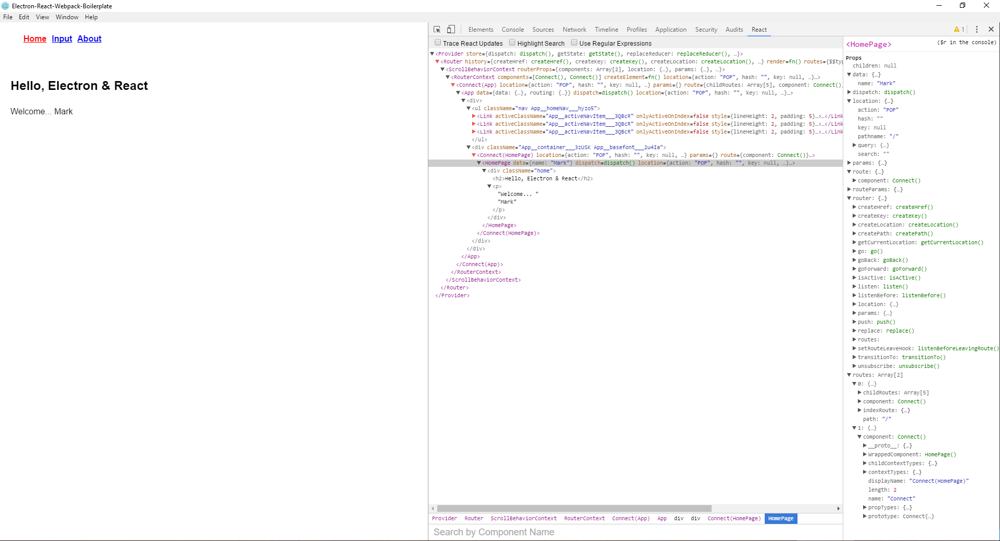

## Electron-React-Webpack-Boilerplate

使用Electron、React、Webpack打包和热加载开发的样板工程，用于快速搭建初始开发环境


## 目录结构

```
 + app                    // 最终打包成Electron资源的文件夹
   + assets               // 字体、图片等资源文件
   + dist                 // Webpack生产环境配置下打包src文件夹输出目录
   - package.json         // 生产环境依赖 dependencies
 + build                  // Webpack配置文件以及其他配置文件存放目录
 + dist                   // Webpack开发环境配置下打包src文件夹输出目录
 + release                // Electron 打包程序输出文件夹，如.dmg、.exe等
 + src                    // 开发源码文件夹
   + main                 // 用于Electron主进程逻辑代码
     + configs
     + services
     - index.js
   + renderer             // 用于Electron渲染进程逻辑代码
     + actions
     + assets
     + components
     + constants
     + containers
     + reducers
     + styles
     + utils
     - index.html
     - index.js
     - routes.js
 + test                   // 测试文件夹
 - package.json           // 开发环境依赖 devDependencies
```

## 命令

```
npm run dev-server        // hot-load server

npm run build-dev         // 开发环境配置下build, 资源文件打包至dist

npm run build             // 用于生产环境的build, 资源文件打包至app/dist

npm run pack              // 仅生成包目录, 不打包, 测试用途

npm run dist              // 打包成安装程序

npm run start             // 启动Electron(开发环境, 请先运行build-dev)
```

## 截图




## React DevTool

请打开`src/main/index.js`文件, 取消第15行注释并修改路径为你的react devtool chrome扩展路径
